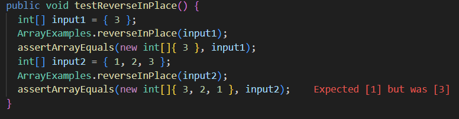

# Week 5 Lab Report by Gabriel Renslow

# `Part 1 - Bugs`

# Failure Inducing Test
```int[] input1 = { 1, 2, 3 };```
```ArrayExamples.reverseInPlace(input1);```
```assertArrayEquals(new int[]{ 3, 2, 1 }, input1);```

# Non-Failure Inducing Test
```int[] input1 = { 3 };```
```ArrayExamples.reverseInPlace(input1);```
```assertArrayEquals(new int[]{ 3 }, input1);```

# Sympton



# Bug/Solution

Before
```
  static void reverseInPlace(int[] arr) {
    for(int i = 0; i < arr.length; i += 1) {
      arr[i] = arr[arr.length - i - 1];
    }
  }
```

After
```
static void reverseInPlace(int[] arr) {
    int[] temp = new int[arr.length];
    for(int i = 0; i < arr.length; i += 1) {
      temp[i] = arr[arr.length - i - 1];
    }
    for(int i = 0; i < arr.length; i +=1) {
      arr[i] = temp[i];
    }
  }
```

# Explanation

In the before section, the loop was editing the array itself that was being used as a source of information, and so as the array was being changed, some essential data was lost. To fix this I implemented a temperorary array system that was copied over at the end.

# `Part 2 - Researching Commands`

Today I will be talking about the 'grep' command.

# 4 examples on txt files

```grep -v "error" log.txt```
This will display all lines that do NOT include 'error'

```grep -l "pattern" *.txt```
This will list of all the names of .txt files that have "pattern" in the name in the current directory

```grep -c "pattern" file.txt```
This will count the amount of lines including "pattern" in 'file.txt'

```grep -E "word1|word2" file.txt```
This will print all lines from file.txt containing either 'word1' or 'word2'

# 4 examples on directories files

```grep -rv "debug" ./src/```
This command will search all files under the ./src/ directory and display lines that do NOT have the word "debug".

```grep -rl "function" ./src/```
This command will search all files under the ./src/ directory and list the names of files that have the word "function".

```grep -rc "error" ./logs/```
This command will search all files under the ./logs/ directory and print the amount of lines containing the word "error" in each file.

```grep -Er "pattern1.*pattern2" ./dir/```
This command will search all files under the ./dir/ directory using the extended regular expression "pattern1.*pattern2".
