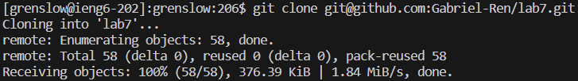

# Week 5 Lab Report by Gabriel Renslow

# `Part 1 - Bugs`

# Failure Inducing Test
```int[] input1 = { 1, 2, 3 };```
```ArrayExamples.reverseInPlace(input1);```
```assertArrayEquals(new int[]{ 3, 2, 1 }, input1);```

# Non-Failure Inducing Test
```int[] input1 = { 3 };```
```ArrayExamples.reverseInPlace(input1);```
```assertArrayEquals(new int[]{ 3 }, input1);```

# Non-Failure Inducing Test
```int[] input1 = { 3 };```
```ArrayExamples.reverseInPlace(input1);```
```assertArrayEquals(new int[]{ 3 }, input1);```

This command allows me to login to my ieng6 environment so I can begin the lab report.

# `Part 2 - Researching Commands`



Keystrokes: ```git clone <ctrl>+v<enter>```

This command allows me to clone my github repo into the environment so I can begin work on it. Ctrl+V was used to copy paste my repo link.

