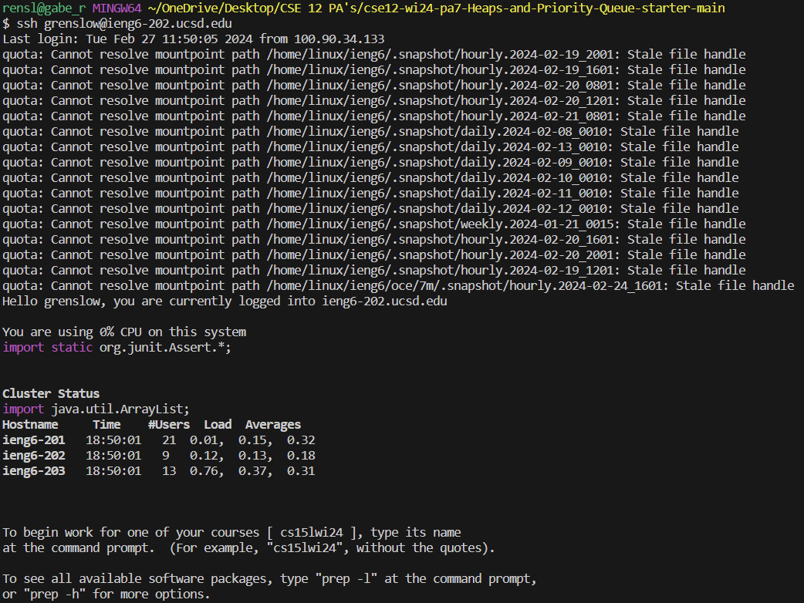

# Week 5 Lab Report by Gabriel Renslow

# `Part 1 - Bugs`



Keystrokes: ```ssh grenslow@ieng6-202.ucsd.edu<enter>```

This command allows me to login to my ieng6 environment so I can begin the lab report.

# `Part 2 - Researching Commands`


Keystrokes: ```git clone <ctrl>+v<enter>```

This command allows me to clone my github repo into the environment so I can begin work on it. Ctrl+V was used to copy paste my repo link.

