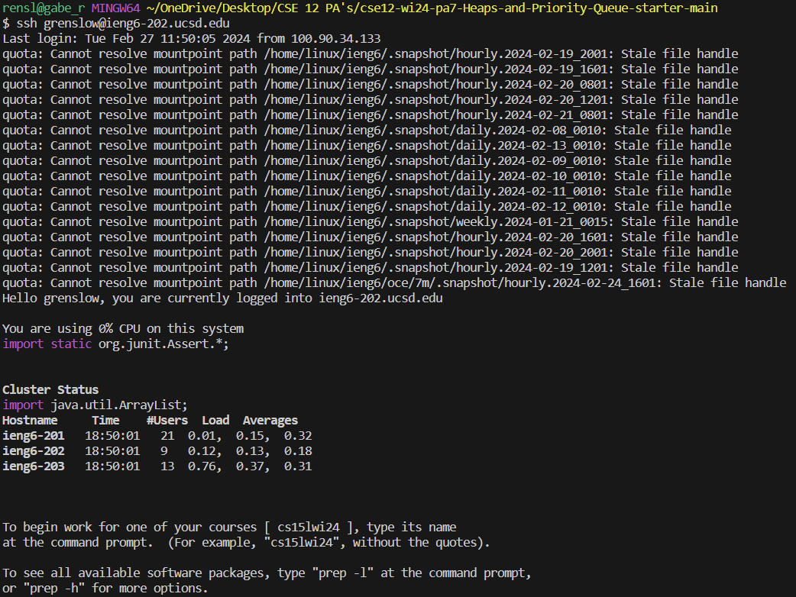
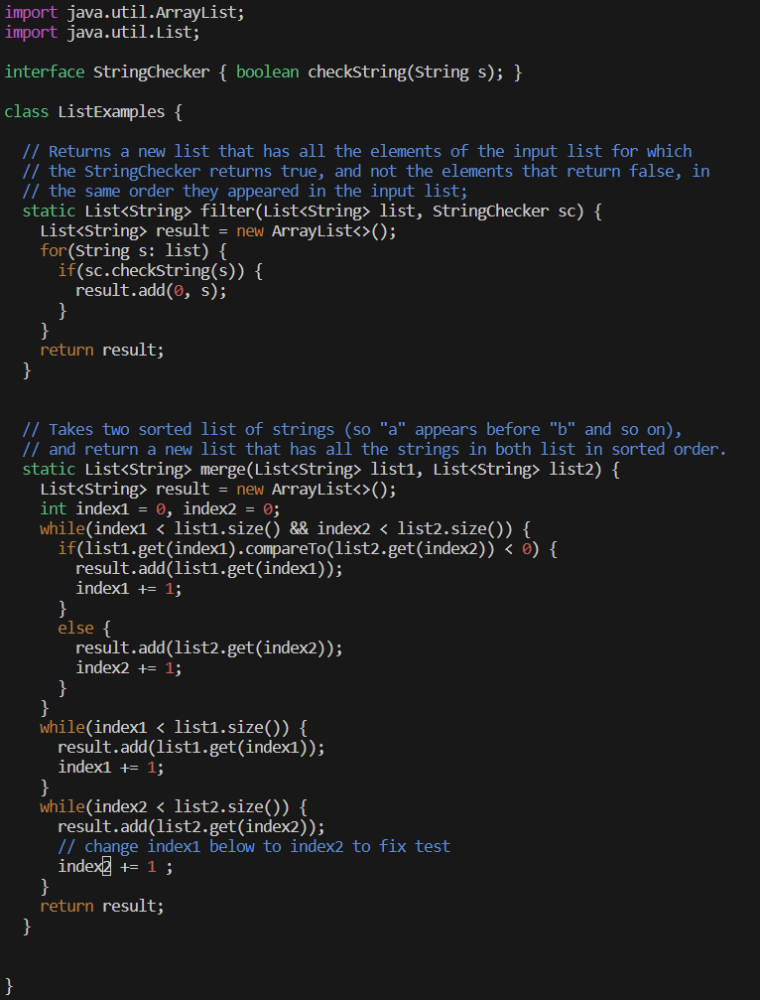
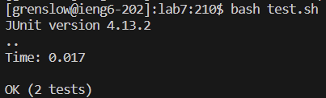

# Week 7 Lab Report by Gabriel Renslow

# `Step 4`



Keystrokes: ```ssh grenslow@ieng6-202.ucsd.edu<enter>```

This command allows me to login to my ieng6 environment so I can begin the lab report.

# `Step 5`


Keystrokes: ```git clone <ctrl>+v<enter>```

This command allows me to clone my github repo into the environment so I can begin work on it. Ctrl+V was used to copy paste my repo link.

# `Step 6`

.png)
.png)

Keystrokes: 
```cd lab7<enter>```
```bash test.sh<enter>```

Here I used the cd command to enter the 'lab7' folder. Then I used the bash command to run the 'test.sh' file. It resulted in 1 failure out of 2 tests.

# `Step 7`



Keystrokes:
```vim ListExamples.java<enter>```
```<down>(until line 41; the input1)```
```<right>(until the '1' in the 'input1' word)```
```x```
```i2```
```<esc>```
```:wq<enter>```

Here I use the vim command to start editing the ListExamplesTests.java so I can fix the problem. I use the arrow keys to reach the error, and then I use the x, and i keys to edit the text so that I fix the problem. I type ':wq' to save and exit the file.

# `Step 8`



Keystrokes:
```bash test.sh<enter>```

Here I use the bash command once again to run the 'test.sh' file and it reported back 'OK' meaning all test results were positive!

# `Step 9`

.png)
.png)

Keystrokes:
```git add ListExamples.java<enter>```
```git commit -m<space>'changed!'<enter>```
```git push origin main<enter>```

Here I use the bash command once again to run the 'test.sh' file and it reported back 'OK' meaning all test results were positive!

This command allows me to login to my ieng6 environment so I can begin the lab report.
