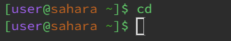
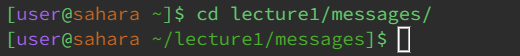
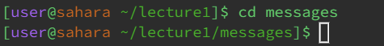
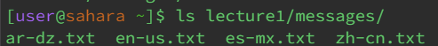
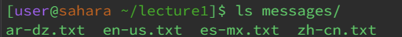
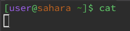
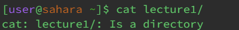
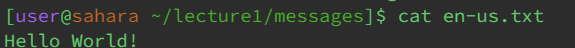

# Week 1 Lab Report by Gabriel Renslow

# ---- CD ----

**cd | no arguments**

Since there are no arguments provided, the cd command returns nothing. (Not an error)

**cd | path to a directory**

Since a directory was provided, the compiler was able to navigate into the file without already being in the folder the file's in. (Not an error)

**cd | path to a file**

In this example the compiler was able to find the folder without giving a directory because the compiler was already inside the folder that the folder referenced in the path was in.

# ---- LS ----

**ls | no arguments**

Since there are no arguments provided, the ls defaults to printing a list of all of the files in the location the compilers in, which in this case are all of the file names in the lecture1 folder. (Not an error)

**ls | path to a directory**

Since a directory was provided, the compiler was able to print all of the file names without already being in the folder the file's in. (Not an error)

**ls | path to a file**

Since a folder name was provided with the compiler already being in the same folder as the file, the compiler is able to locate the folder and so it prints out it's contents. (Not an error)

# ---- CAT ----

**cat | no arguments**

Since there are no arguments provided, the cat command had no file to read, and so it defaults to standard input, meaning it prints whatever text is entered into the compiler. (This is not an error since the command has an alternative to not getting any arguments) 

**cat | path to a directory**

In this example, a directory to the lecture1 folder was provided, but since the file is a folder and not a file including text such as a .txt or .java file, the terminal prints out an error telling the user that lecture1 is just a directory and not a file. (This is an error)

**cat | path to a file**

Since a file name was provided with the compiler already being in the same folder as the file, the command runs successfully and prints out the content for, in this case, en-us.txt. (Not an error)
