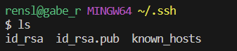
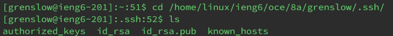
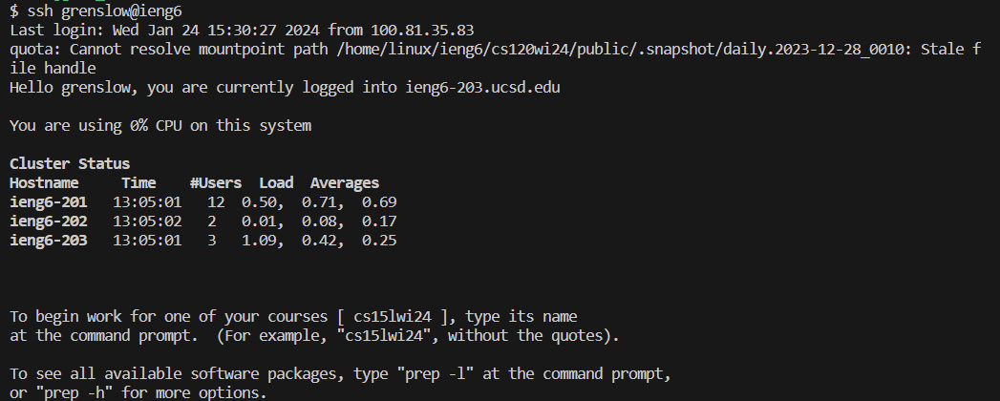

# Week 2 Lab Report by Gabriel Renslow

# `Part 1`

**Example 1**

In the screenshot, the "handleRequest" method is being run. This method takes the given URL as an input, splits it into two parts checking for both a username, and a message to handle. 
As for relevant fields, we have "parameters", a list of strings thats derived from splitting the url accross the inputed username and message to send. After that there are two corresponding String variables representing the username, "secondPart", which in this example is set to "Michael", and the inputed message to send "firstPart", which is being set to "hi!". Finally we have the "printable" String variable, which is set to "Michael: hi!" which combines firstPart and secondPart to serve as the final return output that's displayed on the page.

**Example 2**

In the screenshot, the "handleRequest" method is being run. This method takes the given URL as an input, splits it into two parts checking for both a username, and a message to handle. 
As for relevant fields, we have "parameters", a list of strings thats derived from splitting the url accross the inputed username and message to send. After that there are two corresponding String variables representing the username, "secondPart", which in this example is set to "Johnny", and the inputed message to send "firstPart", which is being set to "wassup!". Finally we have the "printable" String variable, which is set to "Johnny: wassup!" which combines firstPart and secondPart to serve as the final return output that's displayed on the page.

# `Part 2`

Public Key Directory: C:\Users\rensl\.ssh/id_rsa.pub

Private Key Directory: /home/linux/ieng6/oce/8a/grenslow/.ssh/id_rsa.pub

Logging in whithout being asked for password:

# `Part 3`

One thing I learned about this week (Week3) that I thought was really interesting was learning about ssh keys and how we were able to use them to connect to our accounts on our computers without logging in.